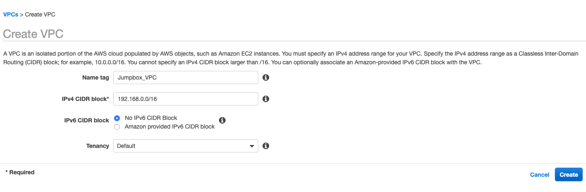
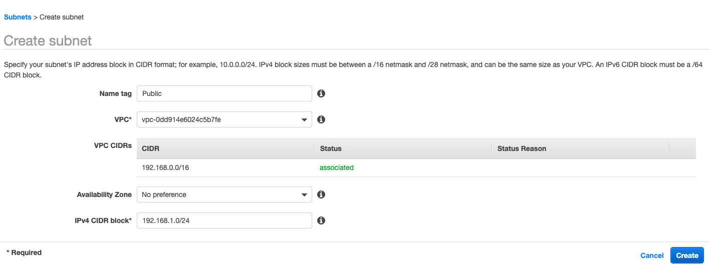
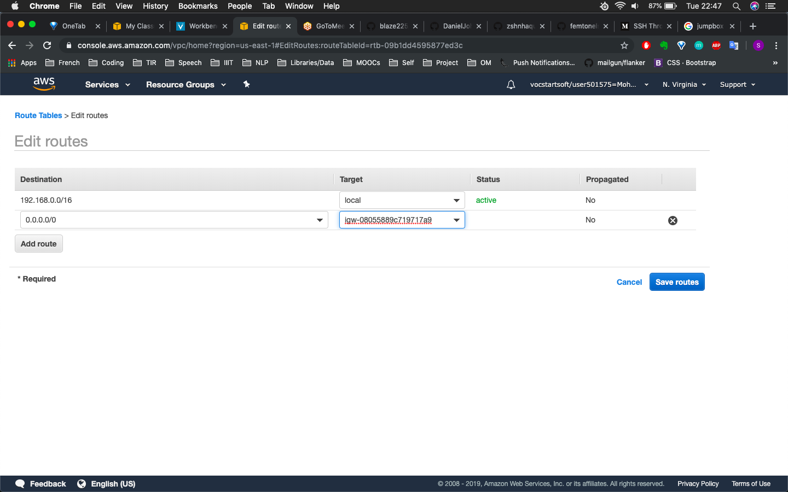
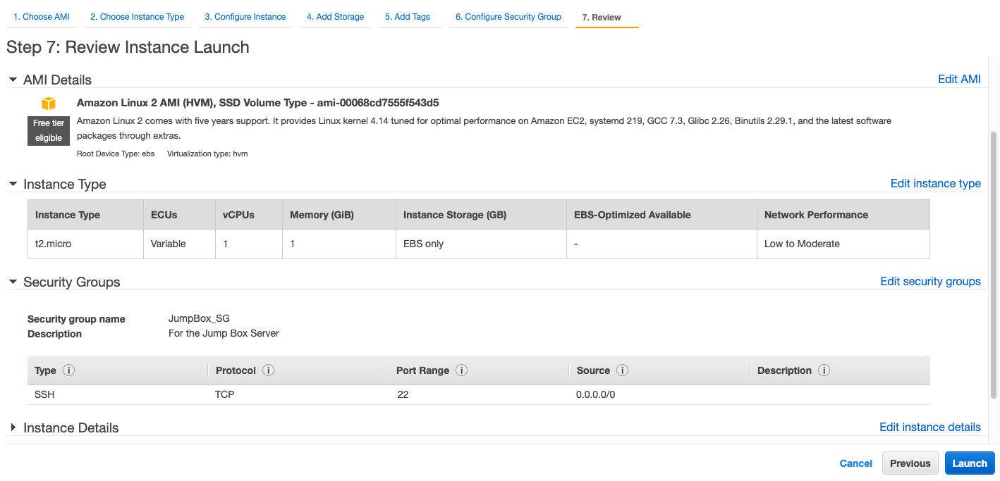
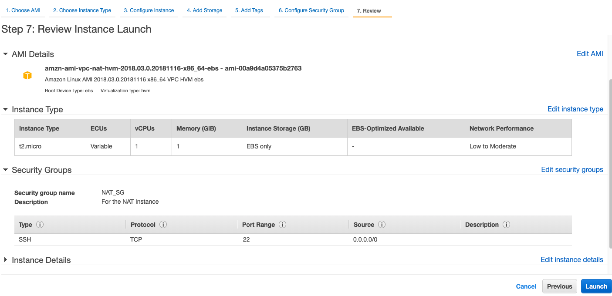
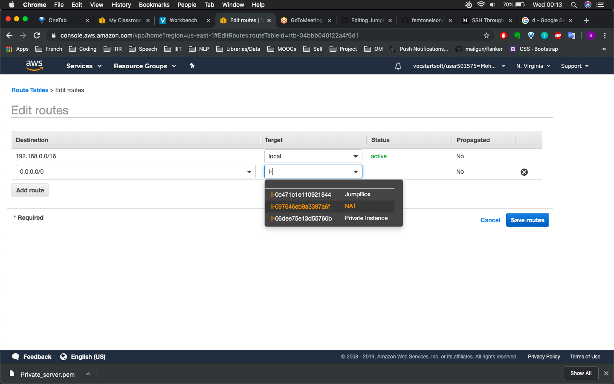
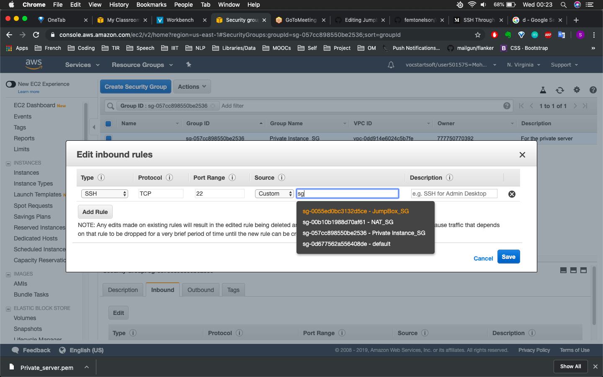
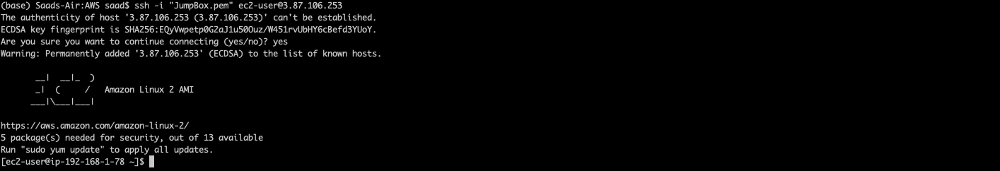
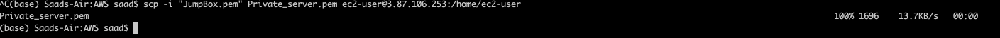

# Tutorial for a Jumpbox Server on AWS
### *Aim*: To connect(via SSH) to a private server instance through a public Jump Box server

## Step 1: Create the VPC with sub networks
* VPC (Virtual Private Cloud) is a virtual network that emulates a traditional network. Follow the follwing steps to create one:
1. Go to your AWS account -> Services -> VPC -> Your VPCs -> Create VPC
2. Give a Name tag, IPv4 CIDR block ( For example *192.168.0.0/16* ) and then click on Create

### Sub Networks
1. Now we need to create sub networks. On your VPC dashboard go to Subnets -> Create Subnet. We will create two subnets associated with this VPC (These will be our public and private sub networks)
2. Give a Name tag and select the VPC that you created above, to associate with. Give a IPv4 CIDR block which will be inside the VPC network (Same first two blocks but different after : For example *192.168.1.0/24* in my case) and click on Create.

3. The public one will have an additional feature: access to the internet via an IGW (*Internet Gateway*)
    1. To do this first create an internet gateway by going to VPC Dashboard -> Internet Gateways -> Create internet gateway -> give a name and create
    2. Now we need to attach this IGW to our VPC. Do this by selecting your created IGW -> Actions -> Attach to VPC

## Step 2: Create the EC2 instances: JumpBox, private server and NAT
1. Go to Services -> EC2 -> Instances -> Launch Instance to start configuring your servers
2. **Jumpbox**
    1. Select the AMI (Amazon Machine Image) and Instance type according to your needs. 
    2. In Configure Instance, make sure you select the correct VPC and the corresponding Public subnet. 
    3. Enable autoassign public IP as the Jumpbox should be accessible on the internet.
    4. Create a new Security Group (Virtual Firewall) which allows SSH.
    5. Create a new key-pair

3. **Private Server**
    * Same steps as above with two differences: In Configure Instance, select the Private subnet and do not enable autoassign public IP as we dont want this server to be accessible to everyone.
4. **NAT (Network Address Translation)**
    * Its purpose is to to enable instances in the private subnet to initiate outbound IPv4 traffic to the Internet, but prevent the instances from receiving inbound traffic initiated by someone on the Internet. (Note: Size of instance will determine network performance)
    1. Here you need to select a different type of AMI which are configured to run as NAT instances. You can find them by seraching for **amzn-ami-vpc-nat** in the Community AMIs category
    2. In Configure Instance select the correct VPC and the corresponding Public subnet
    3. Enable autoassign public IP as we need the NAT to internet access.
    4. Create a new Security Group (Virtual Firewall) which allows SSH.
    5. We dont need a key-pair here as we wont be connecting to the NAT

## Step 3: Configure Security Groups and Routes
1. Remember that we configured the route table for the Public subnet but not for the Private subnet. We want a different route table since we need to direct requests to the NAT.
    * Create a new route table by going to VPC Dashboard -> Route Tables -> Create route table. Name it and associate it to the correct VPC.
    * Go to Subnets -> Private -> Route table tab -> Edit route table association and change the route table ID to the newly created one.

2. Configuring the security group for the private server so as to only allow connections from the Jump box
    * Go to EC2 Dashboard -> Instances -> <*Your Private Instance*> -> Description -> Click on the Security Group. You will be taken to the security group settings.
    * There select the Inbound tab -> Edit and type 'sg' in the Source Column to get a list of security groups. Select the Jump box one.

## Step 4: Connect to the Private Server
1. Connect to the JumpBox
    * `ssh -i <keypair file> ec2-user@<public ip>`

2. Now to connect to the Private server, we need its keypair file which is on our system. So, we need to transfer the key for Private server to the Jumpbox via the command **scp**
    * `scp -i <keypair file> <Source file: Private server keypair> <Destination path: Jump box>`

3. SSH to the Private server using its keypair

